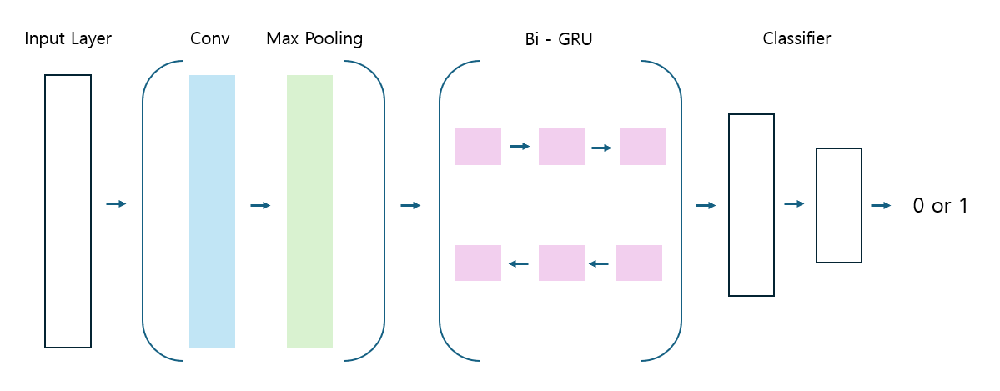

# Korean Character-level Hate Speech Detection

- **자모 단위**로 한국어 욕설 및 혐오 표현을 탐지하는 모델을 학습하는 코드입니다.         
- **CNN + GRU** 구조에 기반해 입력 텍스트의 **'Hate/Clean'** 여부를 판별하는 이진 분류 모델입니다.              

&nbsp;&nbsp;&nbsp;

## 1. Model
- Transformer 기반의 PLM은 실시간의 채팅/댓글을 처리하기에 충분히 빠르지 않을 수 있습니다. 
- 실시간의 데이터를 빠르게 처리하기 위해 다음과 같이 **CNN + GRU** 구조로 모델을 설계했습니다. [\[code\]]()

<p align="center">

</p>
  
- 학습 데이터가 충분할 경우, CNN 층을 늘리거나 GRU를 LSTM으로 대체해 성능을 개선할 수 있습니다.

 
## 2. Character-level Tokenization  
- 자모를 이용한 욕설 및 혐오 표현을 탐지하기 위해 **자모 단위**로 토크나이징을 합니다.
- 한글의 유니코드를 이용해 각 음절에 대응하는 자모를 찾은 후, 기존의 음절을 자모로 대체합니다. [\[code\]]()
- 특수 문자를 이용한 욕설을 처리하기 위해 어휘사전(vocab)에 직접 특수 문자를 추가할 수 있습니다. [\[code\]]()
  

```python
# 형태가 유사한 특수문자를 각 초성과 동일한 숫자로 인코딩 
class AddVocab:
    CHOSUNG = { ...
        'ㄹ':['㉣','㈃', '己'],
        'ㅁ':['㉤','㈄','口'],
        'ㅂ':['㉥','㈅','廿'],
        'ㅅ':['㉦','㈆', '人'], 
    ... }
```

## 3. Dataset 
- 모델 학습과 평가를 위해 다음 한국어 Hate Speech Detection 데이터 셋을 사용했습니다.
  - [BEEP!](https://github.com/kocohub/korean-hate-speech)
  - [욕설 감지 데이터셋](https://github.com/2runo/Curse-detection-data)
  - [Korean UnSmile Dataset](https://github.com/smilegate-ai/korean_unsmile_dataset)
  - 개인적으로 수집한 게임 도메인 댓글 등

- 표현의 자유를 보장하기 위해 **(1) 감탄사, (2) 자신을 향한 욕설**에 해당하는 샘플은 레이블을 직접 수정했습니다.
```
(원본) 이 게임을 돈 주고 산 내가 진짜 ㅄ이지ㅋㅋ → Hate Speech 'True'
(수정) 이 게임을 돈 주고 산 내가 진짜 ㅄ이지ㅋㅋ → Hate Speech 'False'
```
- 학습, 검증, 테스트에 사용한 샘플의 개수는 다음과 같습니다.
  - Train : 36,000 / Validation : 2,000 / Test : 2,000

&nbsp;&nbsp; (※학습에 사용한 데이터 셋은 제공하지 않습니다.)

## 4. Performance
- 학습에 적용한 하이퍼파라미터는 다음과 같습니다.
  - Embedding Dimension : 100
  - Number of Kernels : 100
  - Kernel Sizes : 3, 4, 5
  - Stride : 1
  - Hidden Dimension of GRU : 100
  - Epochs : 30
  - Dropout : 0.2
  - Batch Size : 128
  - Learning Rate : 1e-3

- 실험 결과는 다음과 같습니다.

|Metric|Performance|
|:---:|:---:|
|Precision|81.52|
|Recall|79.49|
|Accuracy|81.56|

- Hate Speech Detection에서는 모델이 Hate 으로 예측한 샘플 중 실제 Hate 의 비율인 **Precision** 이 중요합니다.
- Precision이 높다는 것은 모델이 Clean 을 잘못 분류하지 않고 Hate 만 정밀하게 찾아냈다는 것을 의미합니다. 

## 5. Implementation
